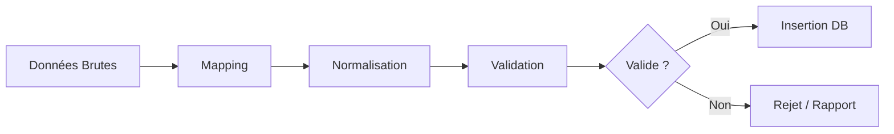

# Spécifications Techniques - Phase 3b : Mapping & Validation d'Import

Ce document détaille la logique technique pour la transformation des fichiers bruts (CSV, Excel) en données exploitable (`PartnerQuote`).

## 1. Flux de Traitement (Pipeline)

Chaque ligne d'un fichier importé passe par les étapes suivantes :



---

## 2. Configuration du Mapping (YAML)

Chaque partenaire peut avoir une structure de fichier différente. Nous utiliserons des fichiers de configuration YAML pour définir comment interpréter leurs fichiers.

### Structure du fichier `configs/partner_mapping.yaml`

```yaml
# Mapping par défaut (si aucun spécifique n'est trouvé)
default:
  columns:
    transport_mode: ["mode", "transport", "type"]
    origin_city: ["ville_depart", "origin_city", "city_from", "depart"]
    origin_country: ["pays_depart", "origin_country", "country_from"]
    origin_postal_code: ["cp_depart", "zip_from", "postal_code_from"]
    dest_city: ["ville_arrivee", "dest_city", "city_to", "arrivee"]
    dest_country: ["pays_arrivee", "dest_country", "country_to"]
    dest_postal_code: ["cp_arrivee", "zip_to", "postal_code_to"]
    weight_min: ["poids_min", "weight_min", "min_kg"]
    weight_max: ["poids_max", "weight_max", "max_kg"]
    cost: ["prix", "price", "montant", "cost"]
    currency: ["devise", "currency"]

# Surcharges spécifiques par Partenaire (via partner_id ou code)
partners:
  "PARTNER_DHL":
    delimiter: ";"  # Spécifique CSV
    columns:
      origin_city: "Ville Départ" # Mapping direct strict
      cost: "Tarif HT"
```

### Logique de Mapping

1.  **Détection Automatique (Fuzzy)** :
    *   Le système normalise les en-têtes du fichier (minuscules, sans accents, `_`).
    *   Il compare avec les alias définis dans `default`.
    *   Ex: `Ville de Départ` -> `ville_de_depart` -> correspond à `origin_city`.

2.  **Configuration Explicite** :
    *   Si une config partenaire existe, elle écrase la détection automatique pour les colonnes spécifiées.

---

## 3. Normalisation des Données

Avant validation, les données sont nettoyées :

| Champ | Traitement | Exemple Entrée | Exemple Sortie |
|-------|------------|----------------|----------------|
| `transport_mode` | Upper case, mapping vers Enum | "routier", "Road" | `ROAD` |
| `cost` | Nettoyage symboles, conversion float | "1 200,50 €" | `1200.50` |
| `country` | Conversion ISO 2 lettres (si possible) | "France", "FR" | `FR` |
| `weight` | Conversion en numérique | "100 kg" | `100.0` |
| `empty` | Conversion chaînes vides en `None` | "" | `None` |

---

## 4. Règles de Validation

Nous utiliserons **Pydantic** pour la validation structurelle et des règles métiers.

### Règles Bloquantes (Erreur Critique)
*   **Champs obligatoires manquants** : `transport_mode`, `origin_city`, `origin_country`, `dest_city`, `dest_country`, `cost`.
*   **Types invalides** : Prix non numérique.
*   **Pays inconnu** : Code pays non valide (ISO 3166-1 alpha-2 attendu).

### Règles de Cohérence
*   `weight_min` <= `weight_max`
*   `valid_until` > Date du jour
*   `origin_country` != `dest_country` (optionnel mais recommandé pour transport inter)

---

## 5. Gestion des Erreurs et Rapport

Le rapport d'erreurs est stocké dans le JSON `ImportJob.errors`.

### Format du JSON d'erreur

```json
[
  {
    "row": 12,
    "status": "INVALID",
    "errors": [
      { "field": "cost", "message": "Le prix doit être positif", "value": "-50" },
      { "field": "dest_country", "message": "Code pays invalide", "value": "ZZ" }
    ],
    "raw_data": { ... } // Copie de la ligne brute pour débogage
  }
]
```

## 6. Implémentation Prévue

### Classes à créer

1.  **`ColumnMapper`** (`app/services/import/column_mapper.py`) :
    *   Charge le YAML.
    *   Applique le mapping sur les headers du Parser.

2.  **`DataNormalizer`** (`app/services/import/data_normalizer.py`) :
    *   Fonctions utilitaires (`clean_price`, `clean_country`).

3.  **`RowValidator`** (`app/services/import/row_validator.py`) :
    *   Utilise un schéma Pydantic `QuoteImportSchema`.
    *   Retourne une liste d'erreurs ou l'objet validé.

### Modifications `ImportService`

*   Intégration de ces 3 classes dans la boucle de traitement `process_import`.
*   Ajout d'une gestion transactionnelle :
    *   Mode "Append" : Ajoute les lignes valides, ignore les erreurs.
    *   Mode "Replace" : Désactive les anciens tarifs du partenaire avant l'import.
